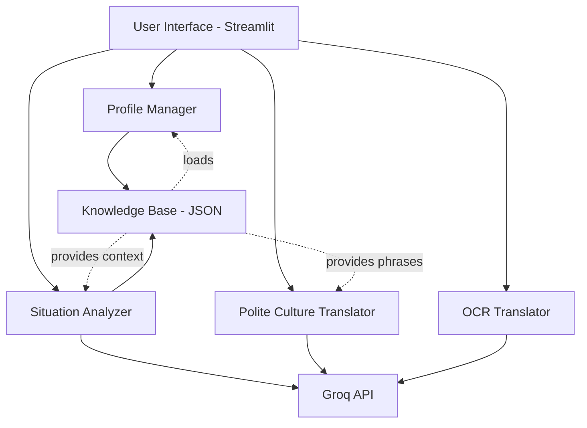

# SafeWonder - Travel Safety Assistant Design Document

## Overview

SafeWonder is a Streamlit-based travel safety application that combines structured knowledge (database.json) with AI intelligence (Groq API) to provide real-time safety analysis, cultural guidance, and multilingual support. The application features a stunning, modern UI with four core modules: Situation Analyzer, Polite Culture Translator, OCR Translator, and User Profile Management.

The design prioritizes immediate accessibility in emergency situations while maintaining an elegant, breath-taking interface that inspires confidence and reduces stress for travelers.

## Architecture

### High-Level Architecture



### Technology Stack

- **Frontend Framework**: Streamlit (Python-based web framework)
- **AI Service**: Groq API (for intelligent analysis and translation)
- **OCR Engine**: Tesseract (pytesseract wrapper)
- **Data Storage**: JSON file (database.json)
- **Styling**: Custom CSS with Streamlit components
- **Voice Input**: Streamlit audio recorder or speech recognition library
- **Voice Output**: Text-to-speech library (gTTS or pyttsx3)

### Application Flow

1. **First Launch**: User completes onboarding → Profile stored in session state → Country data loaded from JSON
2. **Main Interface**: Navigation sidebar → Feature selection → Feature-specific UI
3. **Situation Analysis**: User input (text/voice) → Groq API with JSON context → Risk assessment → Display results
4. **Translation**: User phrase → Groq API with cultural context → Translated output with pronunciation
5. **OCR**: Image upload → Tesseract extraction → Language detection → Groq translation → Display with warnings

## Components and Interfaces

### 1. User Profile Manager (`profile_manager.py`)

**Purpose**: Handle user onboarding and profile data management

**Key Functions**:
```python
def show_onboarding_screen() -> dict:
    """Display onboarding form and collect user profile data"""
    
def validate_profile(profile: dict) -> tuple[bool, str]:
    """Validate profile data completeness and format"""
    
def load_country_data(country_id: str) -> dict:
    """Load specific country data from database.json"""
    
def save_profile_to_session(profile: dict):
    """Store profile in Streamlit session state"""
```

**UI Components**:
- Animated welcome screen with logo
- Multi-step form with progress indicator
- Dropdown selectors for country, language, gender
- Date picker for arrival date
- Radio buttons for safety preference
- Elegant submit button with loading animation

### 2. Situation Analyzer (`situation_analyzer.py`)

**Purpose**: Analyze user-described situations and provide safety recommendations

**Key Functions**:
```python
def analyze_situation(description: str, country_data: dict, groq_api_key: str) -> dict:
    """
    Send situation to Groq API with JSON context
    Returns: {
        'risk_score': int,
        'pattern_matched': str,
        'risk_explanation': str,
        'what_to_do': list,
        'what_not_to_do': list,
        'emergency_numbers': dict,
        'local_phrases': dict,
        'cultural_notes': str
    }
    """
    
def match_keywords(description: str, scams: list, harassment: list) -> list:
    """Match situation keywords against JSON patterns"""
    
def build_groq_prompt(description: str, country_data: dict, user_profile: dict) -> str:
    """Construct intelligent prompt for Groq API"""
    
def calculate_risk_score(groq_response: dict, matched_patterns: list) -> int:
    """Determine risk level 0-100"""
```

**Groq API Prompt Template**:
```
You are a Safety AI assistant for travelers. Analyze the following situation:

USER SITUATION: {user_description}

TRAVELER PROFILE:
- Gender: {gender}
- Native Language: {native_language}
- Destination: {country}, {city}

KNOWLEDGE BASE CONTEXT:
{relevant_scams_from_json}
{relevant_harassment_patterns_from_json}
{cultural_rules_from_json}

TASK:
1. Match keywords to identify scam/harassment patterns
2. Assess risk level (0-100)
3. Provide specific actions from knowledge base
4. Add intelligent reasoning beyond the JSON data
5. Include emergency contacts and cultural guidance

OUTPUT FORMAT:
{
  "risk_score": <0-100>,
  "pattern_matched": "<name>",
  "risk_explanation": "<why this is risky>",
  "what_to_do": ["step1", "step2"],
  "what_not_to_do": ["avoid1", "avoid2"],
  "emergency_numbers": {...},
  "local_phrases": {...},
  "cultural_notes": "<explanation>"
}
```

**UI Components**:
- Large text area for situation description
- Voice input button with recording indicator
- "Analyze Situation" button with loading spinner
- Risk score display with color-coded gauge (green/yellow/red)
- Expandable sections for each result category
- Emergency button (always visible, prominent)
- Copy-to-clipboard buttons for phone numbers

### 3. Polite Culture Translator (`culture_translator.py`)

**Purpose**: Translate phrases with cultural appropriateness and pronunciation guidance

**Key Functions**:
```python
def translate_phrase(phrase: str, source_lang: str, target_lang: str, 
                    country_data: dict, groq_api_key: str) -> dict:
    """
    Translate with cultural context
    Returns: {
        'translated_text': str,
        'pronunciation': str,
        'tone_guidance': str,
        'cultural_notes': str,
        'audio_url': str  # TTS output
    }
    """
    
def get_common_phrases(country_data: dict) -> dict:
    """Retrieve pre-defined phrases from JSON"""
    
def text_to_speech(text: str, language: str) -> bytes:
    """Generate audio for translated phrase"""
```

**Groq API Prompt Template**:
```
You are a cultural translation expert. Translate the following phrase:

PHRASE: {user_phrase}
FROM: {source_language}
TO: {target_language}
DESTINATION: {country}

CULTURAL CONTEXT:
{cultural_dos_and_donts_from_json}
{local_phrases_from_json}

REQUIREMENTS:
1. Translate accurately
2. Make it culturally polite and appropriate
3. Provide pronunciation guide (phonetic)
4. Explain tone and body language
5. Note any cultural sensitivities

OUTPUT FORMAT:
{
  "translated_text": "<translation>",
  "pronunciation": "<phonetic guide>",
  "tone_guidance": "<how to say it>",
  "cultural_notes": "<important context>"
}
```

**UI Components**:
- Two-column layout (source | target)
- Text input with language indicator
- Quick-select common phrases (from JSON)
- Translate button
- Pronunciation guide with phonetic text
- Play audio button (TTS)
- Tone and etiquette tips in callout box
- Swap languages button for bidirectional translation

### 4. OCR Translator (`ocr_translator.py`)

**Purpose**: Extract text from images and translate with safety warnings

**Key Functions**:
```python
def extract_text_from_image(image: bytes) -> tuple[str, str]:
    """
    Use Tesseract to extract text
    Returns: (extracted_text, detected_language)
    """
    
def detect_language(text: str) -> str:
    """Identify language of extracted text"""
    
def translate_and_analyze(text: str, source_lang: str, target_lang: str,
                         groq_api_key: str) -> dict:
    """
    Translate text and check for suspicious content
    Returns: {
        'translated_text': str,
        'warning': str | None,
        'explanation': str
    }
    """
```

**Groq API Prompt Template**:
```
You are analyzing text extracted from an image for a traveler.

EXTRACTED TEXT: {ocr_text}
DETECTED LANGUAGE: {language}
TRANSLATE TO: {target_language}

TASK:
1. Translate the text accurately
2. Identify if this text contains:
   - Scam indicators
   - Unusual charges
   - Suspicious requests
   - Important warnings
3. Explain what the text means in context

OUTPUT FORMAT:
{
  "translated_text": "<translation>",
  "warning_level": "<none|low|medium|high>",
  "explanation": "<what this text means>",
  "suspicious_elements": ["<if any>"]
}
```

**UI Components**:
- Image upload area (drag-drop or camera)
- Image preview
- "Extract & Translate" button
- Side-by-side display: original text | translated text
- Detected language badge
- Warning banner (if suspicious content detected)
- Explanation text below translation

### 5. Main Application (`app.py`)

**Purpose**: Orchestrate all components and manage navigation

**Key Functions**:
```python
def main():
    """Main application entry point"""
    
def load_custom_css():
    """Inject custom styling"""
    
def show_navigation():
    """Render sidebar navigation"""
    
def show_emergency_button():
    """Persistent emergency access"""
    
def initialize_session_state():
    """Setup session variables"""
```

**Navigation Structure**:
```
SafeWonder
├── 🏠 Home (if not onboarded, show onboarding)
├── 🚨 Situation Analyzer
├── 🗣️ Polite Translator
├── 📸 OCR Translator
├── ⚙️ Profile Settings
└── 🆘 Emergency (always accessible)
```

## Data Models

### User Profile Model
```python
@dataclass
class UserProfile:
    name: str
    native_language: str
    traveling_to_country: str
    traveling_to_city: str
    arrival_date: str
    gender: str
    safety_preference: str  # "cautious" | "balanced" | "minimal"
```

### Situation Analysis Result Model
```python
@dataclass
class SituationAnalysis:
    risk_score: int  # 0-100
    pattern_matched: str
    risk_explanation: str
    what_to_do: List[str]
    what_not_to_do: List[str]
    emergency_numbers: Dict[str, str]
    local_phrases: Dict[str, str]
    cultural_notes: str
```

### Translation Result Model
```python
@dataclass
class TranslationResult:
    original_text: str
    translated_text: str
    source_language: str
    target_language: str
    pronunciation: str
    tone_guidance: str
    cultural_notes: str
    audio_data: Optional[bytes]
```

### OCR Result Model
```python
@dataclass
class OCRResult:
    extracted_text: str
    detected_language: str
    translated_text: str
    warning_level: str  # "none" | "low" | "medium" | "high"
    explanation: str
    suspicious_elements: List[str]
```

## Error Handling

### API Error Handling
```python
def call_groq_api_with_retry(prompt: str, api_key: str, max_retries: int = 3) -> dict:
    """
    Implement exponential backoff for API failures
    Handle: rate limits, timeouts, invalid responses
    """
```

### Error Categories:
1. **API Errors**: Rate limit, timeout, invalid key → Show user-friendly message, suggest retry
2. **OCR Errors**: No text detected, poor image quality → Guide user to retake photo
3. **Data Errors**: Missing country in JSON → Fallback to generic safety advice
4. **Network Errors**: No internet connection → Show cached emergency numbers

### User Feedback:
- Toast notifications for transient errors
- Modal dialogs for critical errors
- Inline validation messages for form inputs
- Loading states for all async operations

## Testing Strategy

### Unit Tests
- `test_profile_manager.py`: Profile validation, country data loading
- `test_situation_analyzer.py`: Keyword matching, risk score calculation
- `test_culture_translator.py`: Translation logic, phrase retrieval
- `test_ocr_translator.py`: Text extraction, language detection

### Integration Tests
- `test_groq_integration.py`: API calls with mock responses
- `test_database_loading.py`: JSON parsing and data retrieval
- `test_session_management.py`: Streamlit session state handling

### UI Tests
- Manual testing checklist for each feature
- Responsive design testing (mobile/desktop)
- Accessibility testing (screen readers, keyboard navigation)

### Test Data
- Mock database.json with test countries
- Sample situation descriptions for each scam type
- Test images for OCR with various languages and quality levels

## Visual Design Specifications

### Color Palette
```css
:root {
  --primary: #6366F1;        /* Indigo - trust, safety */
  --secondary: #EC4899;      /* Pink - energy, attention */
  --success: #10B981;        /* Green - safe, good */
  --warning: #F59E0B;        /* Amber - caution */
  --danger: #EF4444;         /* Red - danger, emergency */
  --background: #0F172A;     /* Dark blue - modern, calm */
  --surface: #1E293B;        /* Lighter dark blue */
  --text-primary: #F1F5F9;   /* Light gray */
  --text-secondary: #94A3B8; /* Medium gray */
}
```

### Typography
- **Headings**: Inter, bold, 24-32px
- **Body**: Inter, regular, 16px
- **Captions**: Inter, medium, 14px
- **Monospace** (for phone numbers, codes): JetBrains Mono

### Component Styling

**Risk Score Gauge**:
- Circular progress indicator
- Color transitions: green → yellow → red
- Large number display in center
- Animated fill on load

**Emergency Button**:
- Fixed position (bottom-right on mobile, top-right on desktop)
- Pulsing red glow animation
- Large touch target (60x60px minimum)
- Icon: 🆘 or phone symbol

**Cards**:
- Rounded corners (12px)
- Subtle shadow with glow effect
- Glassmorphism effect (semi-transparent background with blur)
- Hover animations (lift effect)

**Input Fields**:
- Rounded borders (8px)
- Focus state with primary color glow
- Clear icons for text inputs
- Microphone icon for voice inputs

### Animations
- Page transitions: Fade in (300ms)
- Button clicks: Scale down slightly (100ms)
- Loading states: Spinner with brand colors
- Success actions: Checkmark animation
- Risk score: Count-up animation

### Layout
- Maximum content width: 1200px
- Responsive breakpoints: 640px (mobile), 1024px (tablet)
- Generous whitespace (24px padding minimum)
- Sticky header with logo and emergency button
- Sidebar navigation (collapsible on mobile)

## Security Considerations

1. **API Key Protection**: Load from environment variables, never expose in client-side code
2. **Input Sanitization**: Validate and sanitize all user inputs before processing
3. **Rate Limiting**: Implement client-side throttling for API calls
4. **Data Privacy**: Store minimal user data, no persistent storage of sensitive information
5. **HTTPS**: Ensure deployment uses HTTPS for all communications

## Performance Optimization

1. **Lazy Loading**: Load country data only when needed
2. **Caching**: Cache Groq API responses for identical queries (session-based)
3. **Image Optimization**: Compress uploaded images before OCR processing
4. **Async Operations**: Use Streamlit's async capabilities for API calls
5. **Minimal Dependencies**: Keep requirements.txt lean for faster startup

## Deployment Considerations

### Environment Variables
```
GROQ_API_KEY=<api_key>
DATABASE_PATH=database.json
APP_ENV=production
DEBUG=False
TESSERACT_PATH=/usr/bin/tesseract
```

### Streamlit Configuration (`.streamlit/config.toml`)
```toml
[theme]
primaryColor = "#6366F1"
backgroundColor = "#0F172A"
secondaryBackgroundColor = "#1E293B"
textColor = "#F1F5F9"
font = "sans serif"

[server]
headless = true
port = 8501
enableCORS = false
enableXsrfProtection = true
```

### Dependencies (`requirements.txt`)
```
streamlit>=1.28.0
groq>=0.4.0
pytesseract>=0.3.10
Pillow>=10.0.0
python-dotenv>=1.0.0
gTTS>=2.4.0
langdetect>=1.0.9
```

### System Dependencies (`packages.txt`)
```
tesseract-ocr
tesseract-ocr-eng
tesseract-ocr-jpn
tesseract-ocr-hin
ffmpeg
```

## Future Enhancements (Out of Scope for MVP)

1. Real-time location tracking with geofencing alerts
2. Community-sourced scam reports
3. Integration with local emergency services APIs
4. Offline mode with cached data
5. Multi-user support for group travel
6. Integration with travel booking platforms
7. AI-powered image analysis for safety assessment
8. Wearable device integration for SOS triggers
